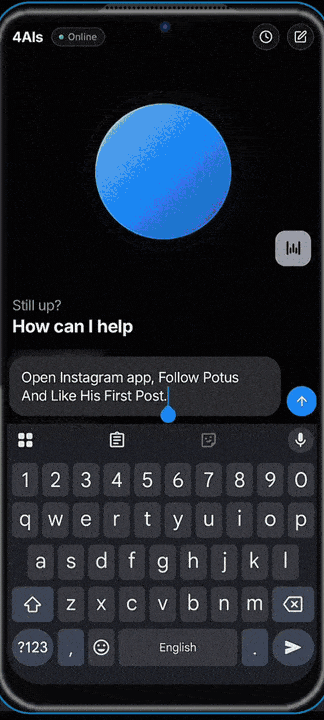

<div align="center">

# 📱 4AIs

**An AI agent that lives on your Android phone — it sees the screen, taps, types, and gets things done.**

No PC. No root. No cloud middleman. Your API key goes straight to the model
provider you choose, and everything else runs on the phone.

[](https://github.com/8crsk/openclaw-android/actions/workflows/ci.yml)
[](LICENSE)

[](https://github.com/8crsk/openclaw-android/stargazers)

[🌐 4ais.in](https://4ais.in) · [📥 Releases](../../releases) · [🔨 Building](docs/BUILDING.md) · [🏗️ Architecture](docs/ARCHITECTURE.md) · [🐛 Report a bug](../../issues)



</div>

Ask it things like *"open WhatsApp and summarize my unread chats"* or *"find a
5-star biryani place nearby and share it with Amma"* — the agent reads the
screen through an AccessibilityService, plans with the LLM of your choice, and
performs real taps, swipes, and typing to finish the job. You approve risky
actions before they happen.

- 🧠 **Bring your own key, pick your brain** — NVIDIA (free-tier models),
  OpenAI, Anthropic, or Google Gemini. Keys are validated in-app and stored in
  Android's encrypted keystore. Nothing is proxied through our servers —
  because there are no servers.
- 📱 **The whole agent runs on-device** — the [OpenClaw](https://openclaw.ai)
  gateway (Node.js) runs inside the app as `libnode.so`. Your phone *is* the
  agent runtime.
- 👆 **Real UI automation** — accessibility-tree reading with stable element
  ids, occlusion filtering, scroll-to-find, wait-for-element, screenshots, and
  a post-action diff of what changed. No ADB, no root.
- ✅ **Human-in-the-loop** — graded-risk approval dialogs, an on-device audit
  log of every agent action, and an optional on-screen overlay showing what
  the agent is doing in real time.
- 🔌 **300+ app integrations (optional)** — plug in a Composio key and the
  agent gets Gmail, Notion, GitHub, Slack and friends as MCP tools.
- ⏰ **Heartbeat** — schedule proactive agent runs ("every morning, check my
  calendar and text me a plan").

> ⚠️ **Status: early.** The core loop — chat → agent → phone control — works.
> Fresh-install setup and streaming polish are actively being hardened. Expect
> rough edges; issues are very welcome.

## 🚀 Quickstart

### 1. Install the app

Grab the latest APK from [Releases](../../releases) (or [build from
source](#-build-from-source)). You need an **arm64 device on Android 8.0+** —
that's virtually every phone from 2017 onward.

### 2. Run the setup wizard

Open the app and follow along: privacy consent → enable the accessibility
service → automatic bootstrap (~3 min, ~200MB — it installs Node.js + the
agent gateway *on the phone*).

### 3. Add a model key

In **Settings → AI provider**, pick a provider and paste your key. No key?
NVIDIA's is free: [build.nvidia.com](https://build.nvidia.com).

### 4. Chat

```
you:   open youtube and find me a 20 minute yoga video
agent: act observe → act tap 14 → act type 3 "20 minute yoga" → …
```

## 🔨 Build from source

```bash
git clone https://github.com/8crsk/openclaw-android.git
cd openclaw-android
./scripts/fetch-node-libs.sh   # prebuilt Node.js libs (~33MB, one-time)
cp local.properties.example local.properties   # set your sdk.dir
./gradlew assembleDebug
```

No API keys are needed to build. See [docs/BUILDING.md](docs/BUILDING.md).

## ⚙️ How it works

```
You ──► Compose UI ──WS-RPC──► OpenClaw gateway (Node.js, on-device)
                                    │ your key, direct
                                    ▼
                            NVIDIA / OpenAI / Anthropic / Gemini
                                    │ "act tap 5"
                                    ▼
                    AccessibilityService (reads screen, taps, types)
```

The model doesn't get raw coordinates — it gets a numbered "legend" of what's
on screen and issues commands like `act tap 5` or `act type 3 hello`. Full
details in [docs/ARCHITECTURE.md](docs/ARCHITECTURE.md).

## 💡 What people use it for

- Summarizing and triaging chats, emails, and notifications
- Multi-step errands: "find X, compare prices, share the best one"
- Morning routines via Heartbeat: calendar check → weather → text a plan
- Hands-free phone control for accessibility needs
- Automating repetitive in-app workflows no API exists for

## 🗺️ Roadmap

- Token-by-token streaming polish (chat renders live, but there's latency to shave)
- Hardened first-run bootstrap across more devices
- More providers (OpenRouter, Groq, local LLM servers)
- Smarter `act` verbs and vision-model fallback for canvas-only apps

## 🤝 Contributing

Contributions wanted on everything above — see
[CONTRIBUTING.md](CONTRIBUTING.md) and the
[`good first issue`](../../labels/good%20first%20issue) label.

## 🔒 Security & privacy

- Prompts and screen content go **only** to the provider you configured.
- The gateway and automation bridge bind to localhost and require per-install
  random tokens.
- Risky agent actions require your approval; everything is audit-logged on
  device. See [SECURITY.md](SECURITY.md) for the full model and how to report
  vulnerabilities.

## 🙏 Credits

- [OpenClaw](https://openclaw.ai) — the agent gateway this app embeds
- [AidanPark/openclaw-android](https://github.com/AidanPark/openclaw-android) —
  the original proof that openclaw can run on Android (MIT)
- [Shizuku](https://shizuku.rikka.app) — optional ADB-level shell access
- [DroidRun Portal](https://github.com/droidrun/droidrun-portal) — inspiration
  for the accessibility legend/occlusion approach

## 📄 License

[MIT](LICENSE) — the app is named **4AIs**; OpenClaw is the upstream gateway
project we embed, not our brand. This is an independent community project,
not affiliated with or endorsed by the OpenClaw team.
